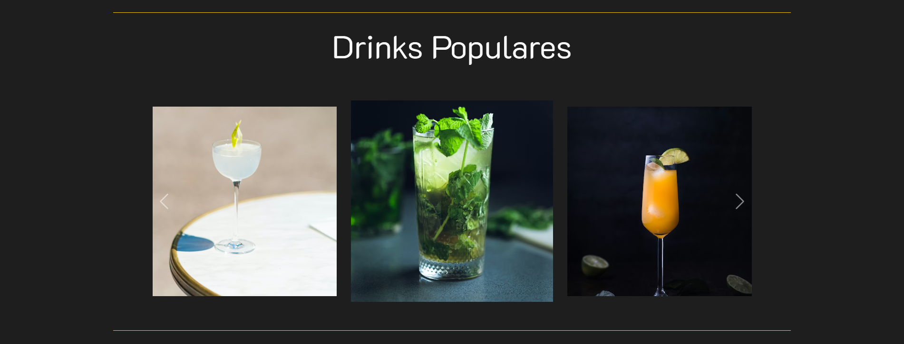
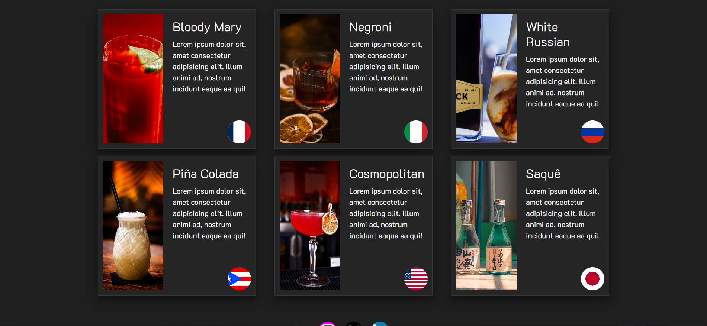
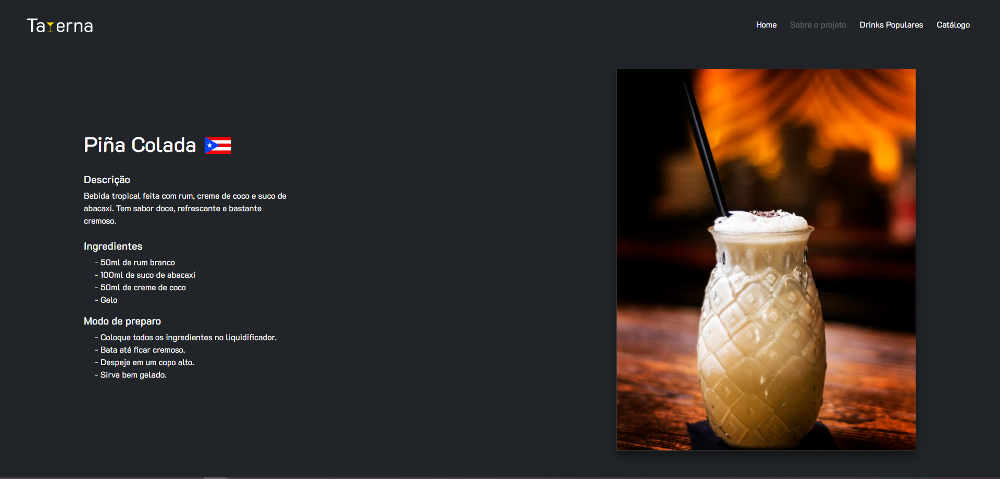

# Trabalho Prático 1

## Informações Gerais

- Nome: Larissa Cravo Carvalho Câmara Santos
- Matricula: 911467
- Proposta de projeto escolhida: Taverna - Site de drinks
- Breve descrição sobre seu projeto: O projeto Taverna consiste em um site temático voltado para a descoberta de drinks típicos de diferentes países ao redor do mundo. A plataforma apresenta bebidas populares e um catálogo organizado com cards que exibem imagem, descrição e país de origem de cada drink. O usuário pode explorar a diversidade cultural das bebidas, além de utilizar filtros e busca para encontrar drinks por nome ou país.

## Print da Homepage







## Print da Página de Detalhes



## JSON utilizado

```json
[
  {
    "id": 1,
    "name": "Bloody Mary",
    "description": "Drink clássico preparado com vodka, suco de tomate, molho inglês, limão e especiarias. Possui sabor marcante e levemente picante.",
    "curiosity": "O Bloody Mary ficou famoso por ser considerado uma bebida 'cura ressaca' devido à combinação de tomate, temperos e álcool.",
    "recipe": {
      "ingredients": [
        "50ml de vodka",
        "100ml de suco de tomate",
        "10ml de suco de limão",
        "2 gotas de molho inglês",
        "Pimenta-do-reino a gosto",
        "Gelo"
      ],
      "steps": [
        "Encha um copo alto com gelo.",
        "Adicione a vodka, o suco de tomate e o suco de limão.",
        "Acrescente o molho inglês e a pimenta.",
        "Misture bem e sirva gelado."
      ]
    },
    "image": "https://images.unsplash.com/photo-1749314375885-ce55f25cd6d6?w=600&auto=format&fit=crop&q=60&ixlib=rb-4.1.0&ixid=M3wxMjA3fDB8MHxzZWFyY2h8MjB8fEJsb29keSUyME1hcnl8ZW58MHx8MHx8fDI%3D",
    "countryImage": "https://upload.wikimedia.org/wikipedia/commons/c/c3/Flag_of_France.svg",
    "country": "França"
  },
  {
    "id": 2,
    "name": "Negroni",
    "description": "Coquetel italiano feito com gin, vermute rosso e Campari em partes iguais. Tem sabor amargo, herbal e sofisticado.",
    "curiosity": "O Negroni surgiu em Florença, na Itália, quando o conde Camillo Negroni pediu gin no lugar de água com gás em um Americano.",
    "recipe": {
      "ingredients": [
        "30ml de gin",
        "30ml de Campari",
        "30ml de vermute rosso",
        "Gelo",
        "Casca de laranja"
      ],
      "steps": [
        "Coloque gelo em um copo baixo.",
        "Adicione o gin, o Campari e o vermute rosso.",
        "Misture suavemente por alguns segundos.",
        "Finalize com casca de laranja."
      ]
    },
    "image": "https://images.unsplash.com/photo-1651877546976-ab61bf889b68?q=80&w=687&auto=format&fit=crop&ixlib=rb-4.1.0&ixid=M3wxMjA3fDB8MHxwaG90by1wYWdlfHx8fGVufDB8fHx8fA%3D%3D",
    "countryImage": "https://upload.wikimedia.org/wikipedia/commons/thumb/0/03/Flag_of_Italy.svg/1280px-Flag_of_Italy.svg.png",
    "country": "Itália"
  },
  {
    "id": 3,
    "name": "White Russian",
    "description": "Drink cremoso preparado com vodka, licor de café e creme de leite. Possui sabor doce e textura suave.",
    "curiosity": "O White Russian ganhou enorme popularidade após aparecer no filme 'O Grande Lebowski', sendo a bebida favorita do personagem principal.",
    "recipe": {
      "ingredients": [
        "50ml de vodka",
        "25ml de licor de café",
        "25ml de creme de leite",
        "Gelo"
      ],
      "steps": [
        "Encha um copo com gelo.",
        "Adicione a vodka e o licor de café.",
        "Misture levemente.",
        "Complete com creme de leite e sirva."
      ]
    },
    "image": "https://images.unsplash.com/photo-1598294147169-fadc4e4a3ae4?q=80&w=1169&auto=format&fit=crop&ixlib=rb-4.1.0&ixid=M3wxMjA3fDB8MHxwaG90by1wYWdlfHx8fGVufDB8fHx8fA%3D%3D",
    "countryImage": "https://upload.wikimedia.org/wikipedia/commons/thumb/f/f3/Flag_of_Russia.svg/960px-Flag_of_Russia.svg.png",
    "country": "Rússia"
  },
  {
    "id": 4,
    "name": "Piña Colada",
    "description": "Bebida tropical feita com rum, creme de coco e suco de abacaxi. Tem sabor doce, refrescante e bastante cremoso.",
    "curiosity": "A Piña Colada é considerada a bebida oficial de Porto Rico desde 1978.",
    "recipe": {
      "ingredients": [
        "50ml de rum branco",
        "100ml de suco de abacaxi",
        "50ml de creme de coco",
        "Gelo"
      ],
      "steps": [
        "Coloque todos os ingredientes no liquidificador.",
        "Bata até ficar cremoso.",
        "Despeje em um copo alto.",
        "Sirva bem gelado."
      ]
    },
    "image": "https://images.unsplash.com/photo-1607446045710-d5a8fd9bc1db?q=80&w=687&auto=format&fit=crop&ixlib=rb-4.1.0&ixid=M3wxMjA3fDB8MHxwaG90by1wYWdlfHx8fGVufDB8fHx8fA%3D%3D",
    "countryImage": "https://upload.wikimedia.org/wikipedia/commons/thumb/2/28/Flag_of_Puerto_Rico.svg/330px-Flag_of_Puerto_Rico.svg.png",
    "country": "Porto Rico"
  },
  {
    "id": 5,
    "name": "Cosmopolitan",
    "description": "Drink elegante preparado com vodka cítrica, licor de laranja, cranberry e limão. Possui sabor equilibrado entre doce e ácido.",
    "curiosity": "O Cosmopolitan ficou mundialmente famoso graças à série 'Sex and the City', nos anos 1990.",
    "recipe": {
      "ingredients": [
        "40ml de vodka cítrica",
        "15ml de licor de laranja",
        "30ml de suco de cranberry",
        "10ml de suco de limão",
        "Gelo"
      ],
      "steps": [
        "Coloque todos os ingredientes em uma coqueteleira com gelo.",
        "Agite bem por alguns segundos.",
        "Coe para uma taça de drink.",
        "Sirva imediatamente."
      ]
    },
    "image": "https://images.unsplash.com/photo-1632987788901-0c090e5f4eaf?q=80&w=687&auto=format&fit=crop&ixlib=rb-4.1.0&ixid=M3wxMjA3fDB8MHxwaG90by1wYWdlfHx8fGVufDB8fHx8fA%3D%3D",
    "countryImage": "https://upload.wikimedia.org/wikipedia/commons/thumb/9/96/Flag_of_the_United_States_%28DDD-F-416E_specifications%29.svg/500px-Flag_of_the_United_States_%28DDD-F-416E_specifications%29.svg.png",
    "country": "Estados Unidos"
  },
  {
    "id": 6,
    "name": "Saquê",
    "description": "Bebida alcoólica japonesa produzida a partir da fermentação do arroz. Pode ser servida quente ou gelada, dependendo do tipo.",
    "curiosity": "Apesar de ser conhecido como 'vinho de arroz', o processo de fabricação do saquê é mais parecido com o da cerveja.",
    "recipe": {
      "ingredients": ["150ml de saquê", "Pequena taça tradicional"],
      "steps": [
        "Escolha servir o saquê quente ou gelado.",
        "Despeje a bebida em uma pequena taça.",
        "Sirva lentamente para preservar o aroma."
      ]
    },
    "image": "https://images.unsplash.com/photo-1571762450239-f0f047321444?q=80&w=1074&auto=format&fit=crop&ixlib=rb-4.1.0&ixid=M3wxMjA3fDB8MHxwaG90by1wYWdlfHx8fGVufDB8fHx8fA%3D%3D",
    "countryImage": "https://upload.wikimedia.org/wikipedia/en/thumb/9/9e/Flag_of_Japan.svg/1280px-Flag_of_Japan.svg.png",
    "country": "Japão"
  }
]
```
